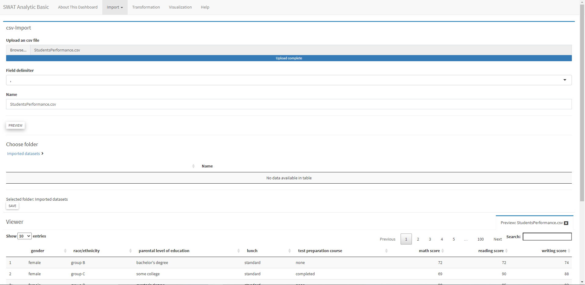

# swat-analytic-basic ver 2

[swat-analytic-basic ver 2](https://mackykavinsky.shinyapps.io/swat-analytic-intermmediate/) 

---

This is one of the project where i collaborated with the main author [DavidBarke](https://github.com/DavidBarke/shinyplyr) to produce a business intelligence application using R.

I added extra functionalities such as the availability of using xls and xlsx files and custom images used. The new functionality is created using module method where the module will be called using call function module.

---

The functionality in the application
- Import data
- Data transformation
- Data visualization

---

How to use the application:

1. Launch the application using RStudio or use the link given
2. Select data type (xls, xlsx, rds, csv) then upload your dataset

3. For transformation, select your dataset.
4. Choose your operation (for example: select) then fill the details based on the criteria needed. 

 
 
5. Visualization is not been finished developed, hence it is not showing up on the tab (this is due my project manager decided to abandoned this project and focus on version 1)

---

Big thanks to David Barke for helping me in collaborating in adding extra functionality. 
